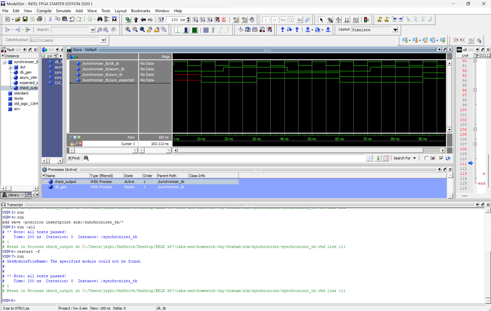

# HW 3 - Synchronizer

## Overview
I creating a 2 flip-flop synchronizer in VHDL to convert asynchronous signals into clock-synchronized signals. After coding the synchronizer, I tested it by using the provided test bench in ModelSim.

## Deliverables

