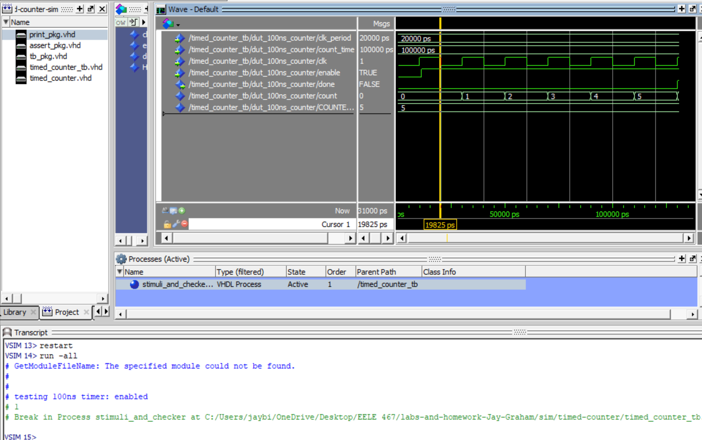
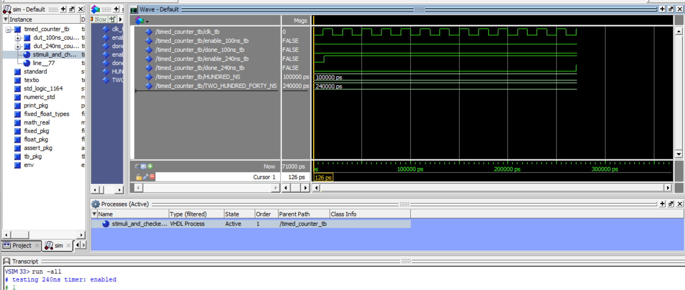
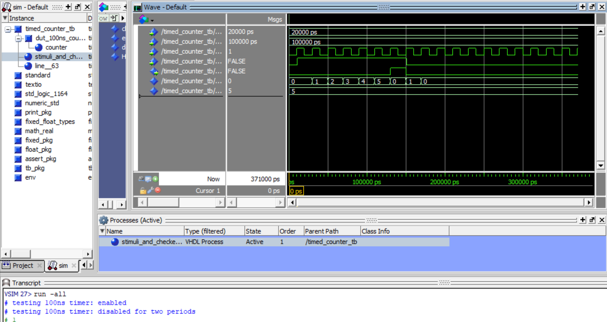
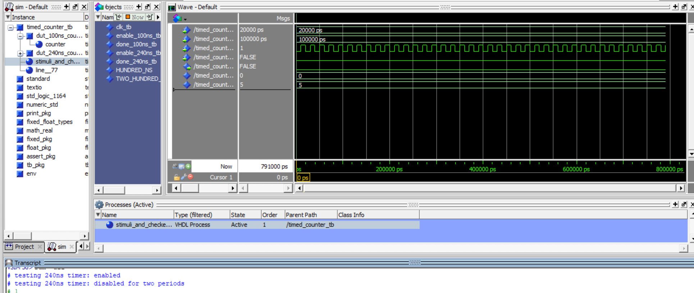
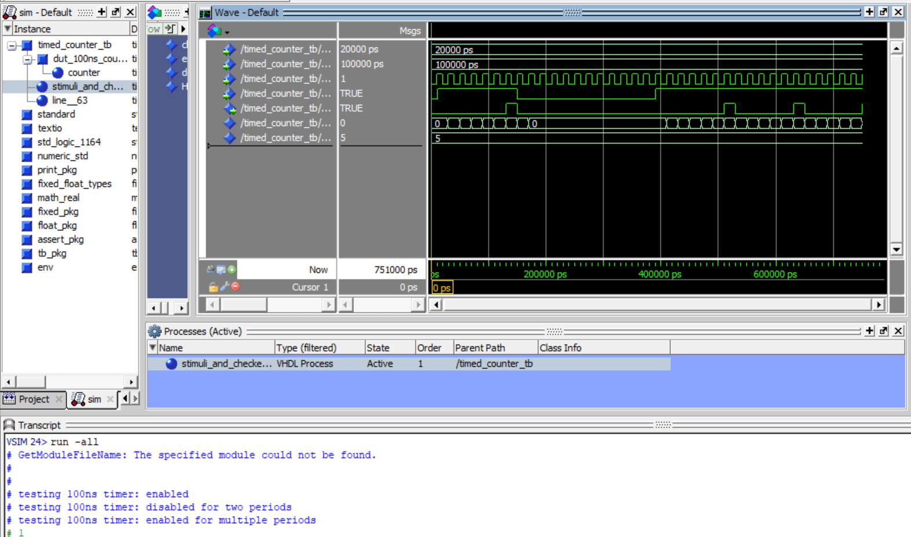
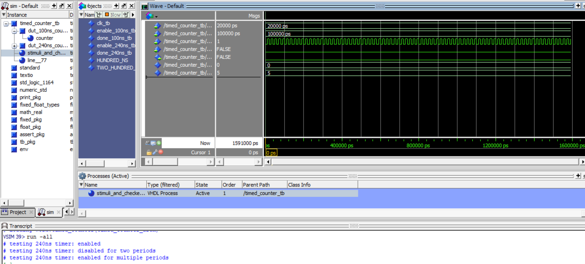

# HW 4 - Times Counter

## Overview
I creating a timed counter in VHDL to assert a done signal after a specified time. With testbenches, I verified the counter's behavior udner various conditions to make sure it worked correcrly for different timing configurations. 

## Deliverables

### Test Case 1: 100ns

### Test Case 1: 240ns

### Test Case 2: 100ns

### Test Case 2: 240ns

### Test Case 3: 100ns

### Test Case 3: 240ns

