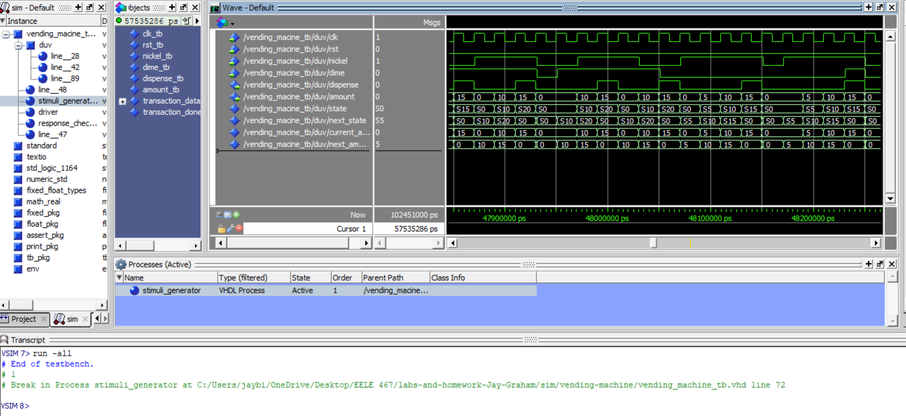

# HW 5 - Vending Machine

## Overview
I creating a timed counter in VHDL to assert a done signal after a specified time. With testbenches, I verified the counter's behavior udner various conditions to make sure it worked correcrly for different timing configurations. 

## Deliverables

