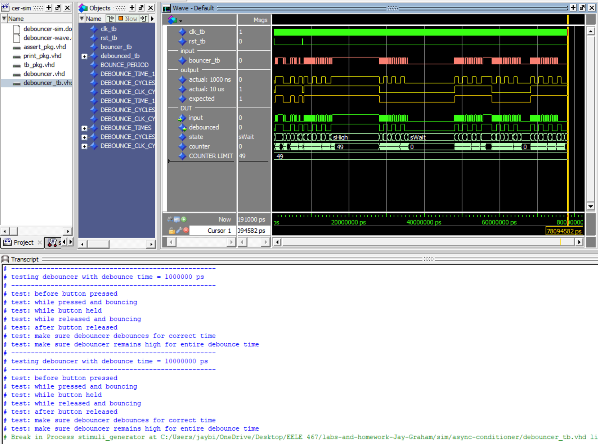
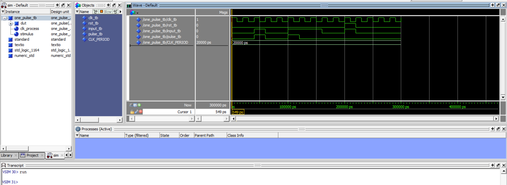
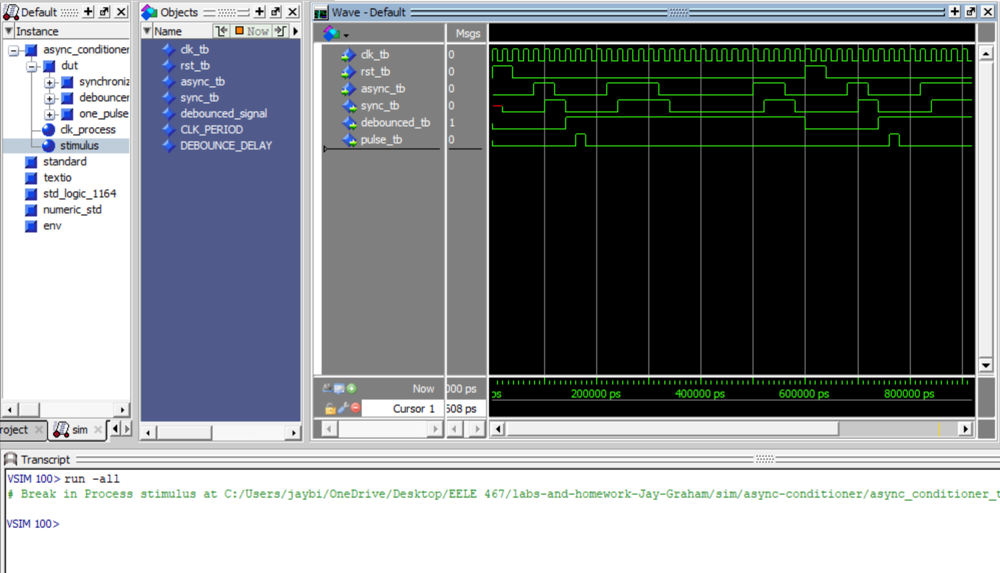

# HW 6 - Async Conditioner

## Overview
I designed and tested an asynchronous signal conditioner using a synchronizer, debouncer, and one-pulse generator. I wrote self-checking test benches for the one-pulse generator and the asynchronous signal conditioner to make sure they were working properly. The debouncer was also verified using a provided test bench. 

## Deliverables

### Debouncer Sim Screenshot

### One Pulse Sim Screenshot

### Async Conditioner Sim Screenshot

